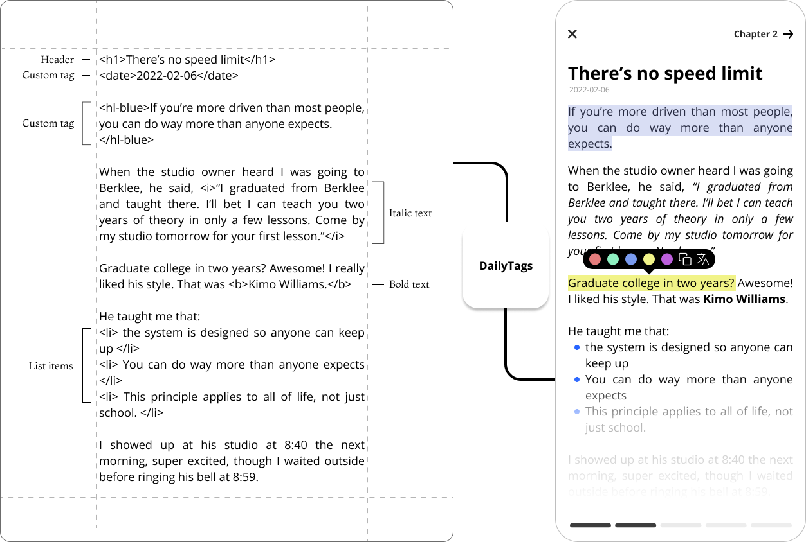

# DailyTags
[](https://jitpack.io/#DmytroShuba/DailyTags)
[](https://android-arsenal.com/api?level=23)

DailyTags is a flexible markdown library that supports custom tags and markups.

The library parses a given markup into rich text for Jetpack Compose. DailyTags comes with Markdown and HTML support by default (please, see the [supported features](https://github.com/DmytroShuba/DailyTags/wiki/Supported-features)) and is very easy to extend to support custom markups.



The library parses text source into nodes which are then styled using [AnnotatedString](https://developer.android.com/reference/kotlin/androidx/compose/ui/text/AnnotatedString). No WebView is required. All you need is to create a rule that defines how the text is extracted and styled. More examples below!

DailyTags aims to be:
- ⚡ fast
- 🪶 lightweight(less than 50kb)
- 👋 easy to use
- 🏗️ extensible
- 📎 flexible

The library provides defaults to display Markdown content along with giving all the means to tweak the appearance as much as you wish!This repository contains DailyTags source code and a sample app.


## 📦 Installation
Add the following configuration to the `build.gradle` files:
```groovy
allprojects {
    repositories {
        ...
        maven { url 'https://jitpack.io' }
    }
}
```

```groovy
dependencies {
    implementation "com.github.DmytroShuba:DailyTags:1.0.0"
}
```

## 🔨 Usage
### Markdown
DailyTags supports most of the Markdown features, but not all ([the supported features](https://github.com/DmytroShuba/DailyTags/wiki/Supported-features)).

To parse Markdown content use SimpleMarkupParser and MarkdownRules together:
```kotlin
val source = "<b>Hello world</b>"
val rules = MarkdownRules.toList()
val parser = SimpleMarkupParser()
val content = parser
    .parse(source, rules)
    .render()
    .toAnnotatedString()

Text(text = content)
```

### Markdown and HTML
```kotlin
val source = "<b>Hello world</b>"
val rules = MarkdownRules.toList() + HtmlRules.toList()
val parser = SimpleMarkupParser()
val content = parser
    .parse(source, rules)
    .render()
    .toAnnotatedString()

Text(text = content)
```

### Custom tags
1. Create a pattern with a regular expression to find the specified content.
```kotlin
val PATTERN_HIGHLIGHT_BLUE = Pattern.compile("^<hl-blue>([\s\S]+?)<\/hl-blue>")
```
2. Create rules for your patterns. A rule includes the pattern and styling configuration for the matched content:
```kotlin
val blueRule = PATTERN_HIGHLIGHT_BLUE.toRule(spanStyles = SpanStyle(color = Color.Blue))
```
3. Use custom rules when parsing the content:

```kotlin
val parser = SimpleMarkupParser()
val rules = listOf(blueRule, ...)
val content = parser
    .parse(source, rules)
    .render()
    .toAnnotatedString()
```

See a detailed step by step guide [here](https://github.com/DmytroShuba/DailyTags/wiki/Add-custom-tags-and-markups).

## 🔎 Wiki
More documentation is going to be released soon so stay tuned!
For more information you can:
- visit DailyTags [Wiki page](https://github.com/DmytroShuba/DailyTags/wiki)
- see the sample application that is included to this repository
- explore source code to see how Markdown is implemented.

If you have a problem using DailyTag please see [Troubleshooting](https://github.com/DmytroShuba/DailyTags/wiki/Troubleshooting) page. It might be already answered!

## 📄 License

```
The MIT License (MIT)

Copyright (c) 2022 Dmytro Shuba

Permission is hereby granted, free of charge, to any person obtaining a copy
of this software and associated documentation files (the "Software"), to deal
in the Software without restriction, including without limitation the rights
to use, copy, modify, merge, publish, distribute, sublicense, and/or sell
copies of the Software, and to permit persons to whom the Software is
furnished to do so, subject to the following conditions:

The above copyright notice and this permission notice shall be included in all
copies or substantial portions of the Software.

THE SOFTWARE IS PROVIDED "AS IS", WITHOUT WARRANTY OF ANY KIND, EXPRESS OR
IMPLIED, INCLUDING BUT NOT LIMITED TO THE WARRANTIES OF MERCHANTABILITY,
FITNESS FOR A PARTICULAR PURPOSE AND NONINFRINGEMENT. IN NO EVENT SHALL THE
AUTHORS OR COPYRIGHT HOLDERS BE LIABLE FOR ANY CLAIM, DAMAGES OR OTHER
LIABILITY, WHETHER IN AN ACTION OF CONTRACT, TORT OR OTHERWISE, ARISING FROM,
OUT OF OR IN CONNECTION WITH THE SOFTWARE OR THE USE OR OTHER DEALINGS IN THE
SOFTWARE.
```